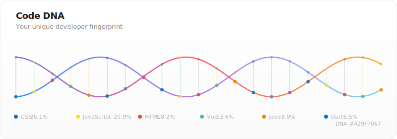
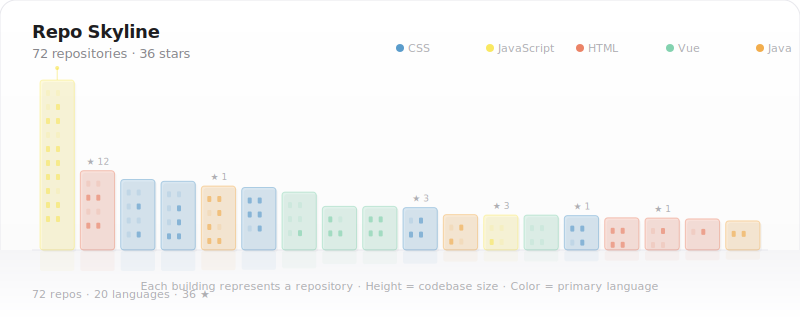
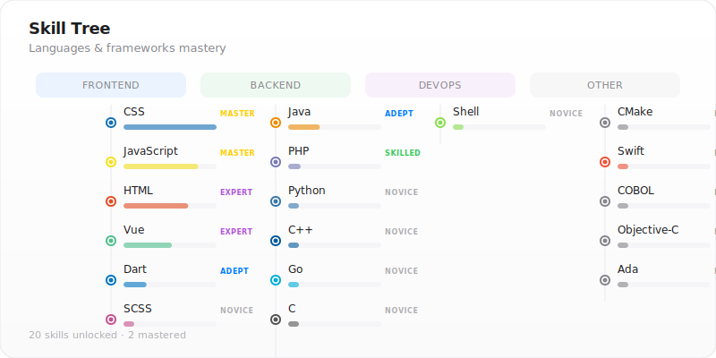
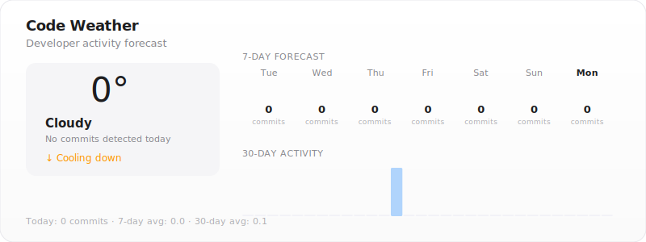

# Hey, I'm Boluwaji Akinsefunmi 👋

**`@IAmMasterCraft`** · Full-Stack Developer · Building things that matter

 

 

&nbsp;&nbsp;&nbsp;
&nbsp;&nbsp;&nbsp;
&nbsp;&nbsp;&nbsp;
&nbsp;&nbsp;&nbsp;

 

---

 

<!-- CODE DNA -->

  

 

<!-- REPO SKYLINE -->

  

 

<!-- SKILL TREE -->

  

 

<!-- CODE WEATHER -->

  

 

---

 

  

 

  

 

---

  Widgets auto-generated with ❤️ by <a href="https://github.com/IAmMasterCraft">@IAmMasterCraft</a> · Updated daily via GitHub Actions

